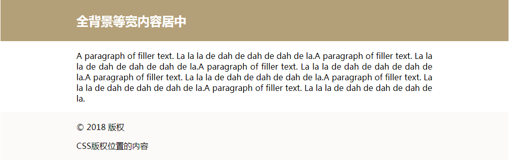

# <b>单列布局-内容居中</b>



`HTML`

```html
<header id="header">这是头部</header>
<section id="main" class="wrap">这是内容部分居中</section>
<section id="footer">这是底部</section>
```

`CSS`

```css
body {
    margin: 0;
    min-width: 900px; /*为浏览器设置最小宽度，小于该宽度时，显示水平滚动条*/
    text-align: center;
}

.wrap {
    width: 900px; /*内容宽度*/
    margin: 0 auto;
}

#header {
    height: 80px;
    background: beige;
}

#main {
    height: 400px;
    background: #e8f0ff;
}

#footer {
    height: 100px;
    background: #d0d4dc;
}
```

