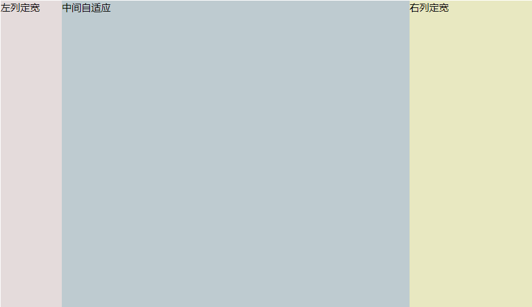

# <b>三列布局-两侧定宽,中间自适应</b>



##### <b>方案一：双飞翼布局方法；</b>

`HTML`

```html
<body>
    <div id="header"></div>
    <div id="parent">
    <!--中间栏需要放在前面-->
        <div id="center">
            <div id="center_inbox">中间自适应</div>
            <hr>  <!--方便观察原理-->
        </div>
        <div id="left">左列定宽</div>
        <div id="right">右列定宽</div>
    </div>
    <div id="footer"></div>
</body>
    ```
`CSS`

```css
#header {
    height: 60px;
    background-color: #ccc;
}
#left {
    float: left;
    width: 100px;
    height: 500px;
    margin-left: -100%; /*调整#left的位置,值等于自身宽度*/
    background-color: #e4dbdb;
    opacity: 0.5;
}
#center {
    height: 500px;
    float: left;
    width: 100%;
    background-color: #becbd0;
}
#center_inbox{
    height: 480px;
    border: 1px solid #000;
    margin: 0 220px 0 120px;  /*关键!!!左右边界等于左右盒子的宽度,多出来的为盒子间隔*/
}
#right {
    float: left;
    width: 200px;
    height: 500px;
    margin-left: -200px;  /*使right到指定的位置,值等于自身宽度*/
    background-color: #e8e8c1;
    opacity: 0.5;
}
#footer {
    clear: both;  /*注意清除浮动!!*/
    height: 60px;
    background-color: #ccc;
}
```
##### <b>浏览器支持率 100%</b>

##### <b>方案二：圣杯布局方法</b>

`HTML`

```html
<body>
    <div id="header"></div>
    <div id="parent">
        <!--#center需要放在前面-->
        <div id="center">中间自适应
            <hr>
        </div>
        <div id="left">左列定宽</div>
        <div id="right">右列定宽</div>
    </div>
    <div id="footer"></div>
</body>
```
`CSS`

```css
#header{
    height: 60px;
    background-color: #ccc;
}
#parent {
    box-sizing: border-box;
    height: 500px;
    padding: 0 215px 0 115px;  /*为了使#center摆正,左右padding分别等于左右盒子的宽,可以结合左右盒子相对定位的left调整间距*/
}
#left {
    margin-left: -100%;  /*使#left上去一行*/
    position: relative;
    left: -115px;  /*相对定位调整#left的位置,正值大于或等于自身宽度*/
    float: left;
    width: 100px;
    height: 500px;
    background-color: #e4dbdb;
    opacity: 0.5;
}
#center {
    float: left;
    width: 100%;  /*由于#parent的padding,达到自适应的目的*/
    height: 500px;
    box-sizing: border-box;
    border: 1px solid #000;
    background-color: #becbd0;
}
#right {
    position: relative;
    left: 215px; /*相对定位调整#right的位置,大于或等于自身宽度*/
    width: 200px;
    height: 500px;
    margin-left: -200px;  /*使#right上去一行*/
    float: left;
    background-color: #e8e8c1;
    opacity: 0.5;
}
#footer{
    height: 60px;
    background-color: #ccc;
}
```
##### <b>浏览器支持率 100%</b>

##### <b>方案三：使用flex实现。</b>

`HTML`

```html
<body>
    <div id="parent">
        <div id="header"></div>
        <!--#center需要放在前面-->
        <div id="center">中间自适应
            <hr>
        </div>
        <div id="left">左列定宽</div>
        <div id="right">右列定宽</div>
        <div id="footer"></div>
    </div>
</body>
```
`CSS`
```css
#parent {
    height: 500px;
    display: flex;
}

#left {
    width: 100px;
    background-color: #e4dbdb;
}

#center {
    flex: 1;
    /*均分#parent剩余的部分*/
    background-color: #becbd0;
}

#right {
    width: 200px;
    background-color: #e8e8c1;
}
```
##### <b>浏览器支持率 98.08%</b>
<iframe src="https://caniuse.bitsofco.de/embed/index.html?feat=flexbox&amp;periods=future_1,current,past_1,past_2,past_3&amp;accessible-colours=false" frameborder="0" width="100%" height="472px"></iframe>

##### <b>方案四：使用Grid实现</b>

`HTML`

```html
<body>
    <div id="parent">
    <div id="header"></div>
    <!--#center需要放在前面-->
    <div id="center">中间自适应
        <hr>
    </div>
    <div id="left">左列定宽</div>
    <div id="right">右列定宽</div>
    <div id="footer"></div>
</div>
</body>
```
`CSS`

```css
#parent {
    height: 500px;
    display: grid;
    grid-template-columns: 100px auto 200px; /*设定3列*/
    grid-template-rows: 60px auto 60px; /*设定3行*/
    /*设置网格区域分布*/
    grid-template-areas: 
        "header header header" 
        "leftside main rightside" 
        "footer footer footer";
}
#header {
    grid-area: header; /*指定在哪个网格区域*/
    background-color: #ccc;
}
#left {
    grid-area: leftside;
    background-color: #e4dbdb;
    opacity: 0.5;
}
#center {
    grid-area: main; /*指定在哪个网格区域*/
    margin: 0 15px; /*设置间隔*/
    border: 1px solid #000;
    background-color: #becbd0;
}
#right {
    grid-area: rightside; /*指定在哪个网格区域*/
    background-color: #e8e8c1;
    opacity: 0.5;
}
#footer {
    grid-area: footer; /*指定在哪个网格区域*/
    background-color: #ccc;
}
```

##### <b>浏览器支持率 87.56%</b>
<iframe src="https://caniuse.bitsofco.de/embed/index.html?feat=css-grid&amp;periods=future_1,current,past_1,past_2,past_3&amp;accessible-colours=false" frameborder="0" width="100%" height="472px"></iframe>


