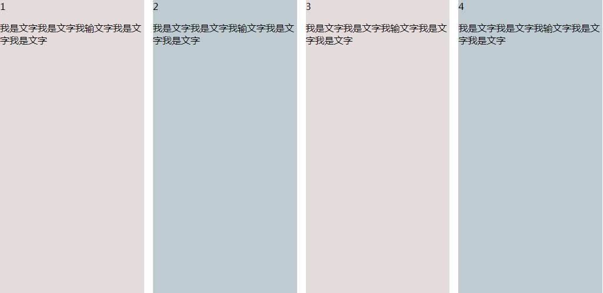

# <b>多列等宽等高布局</b>



##### <b>方案一：`column`方法</b>

```html
<div class="demo">
    <!--列数：有几个模块-->
    <div class="one">第一个</div>
    <div class="two">第二个</div>
    <div class="three">第三个</div>
</div>
```
```css
.demo {
    height: 200px;
    columns: 3;    /*设置多列的个数,与div个数相同*/ 
}
.one {
    background: beige;
    height: 200px;  /*每个模块的高度必须相同*/
}
.two {
    background: blanchedalmond;
    height: 200px;
}
.three {
    background: beige;
    height: 200px;
}
```

<b>说明</b>
1. `columns-width` 每一列的最小宽度；
2. `columns-count` 拥有的最多列数；
3. `columns-gap` 每一列之间的间距；
4. `columns-rule` 定义列边框 columns:1px solid #ccc；
5. `columns-span` 定义多列布局中子元素的跨列效果，通常用于标题。
    只有两个属性值   columns-span:none / all;  不跨列 / 跨所有列

##### <b>方案一：`display:flex`方法</b>

`HTML`

```html
<div id="parent">
    <div class="column">1
        <p>我是文字我是文字我输文字我是文字我是文字</p>
    </div>
    <div class="column">2
        <p>我是文字我是文字我输文字我是文字我是文字</p>
    </div>
    <div class="column">3
        <p>我是文字我是文字我输文字我是文字我是文字</p>
    </div>
    <div class="column">4
        <p>我是文字我是文字我输文字我是文字我是文字</p>
    </div>
</div>
```

`CSS`

```css
#parent {
    margin-left: -15px;
    /*使内容看起来居中*/
    height: 500px;
    display: flex;
}
.column {
    flex: 1;
    /*一起平分#parent*/
    margin-left: 15px;
    /*设置间距*/
}
.column:nth-child(odd) {
    background-color: #e4dbdb;
}
.column:nth-child(even) {
    background-color: #becbd0;
}
```

##### <b>浏览器支持</b>
<iframe src="https://caniuse.bitsofco.de/embed/index.html?feat=multicolumn&amp;periods=future_2,future_1,current,past_1,past_2,past_3&amp;accessible-colours=false" frameborder="0" width="100%" height="465px"></iframe>

<iframe src="https://caniuse.bitsofco.de/embed/index.html?feat=flexbox&amp;periods=future_2,future_1,current,past_1,past_2,past_3&amp;accessible-colours=false" frameborder="0" width="100%" height="510px"></iframe>


