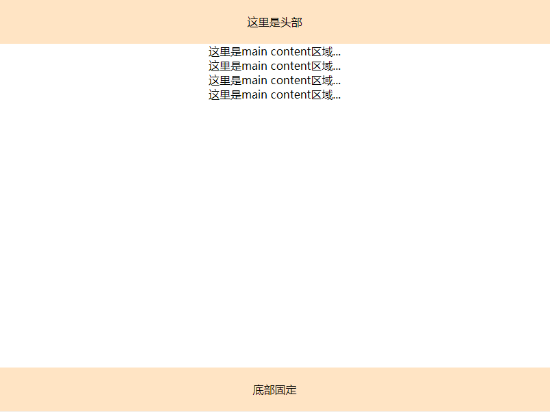

# <b>sticky布局：底部固定</b>



> <b>方案一：Sticky footer 布局 — 负 margin 方式</b>

`HTML`

```html
<div class="content">
    <div class="wrapper">
        <div class="title">
            <p>这里是头部</p>
        </div>
        <div class="main">
            <p>这里是main content区域...</p>
            <p>这里是main content区域...</p>
            <p>这里是main content区域...</p>
            <p>这里是main content区域...</p>
        </div>
    </div>
</div>
<div class="footer">
    <p>底部固定</p>
</div>
```

`CSS`
```css
* {
    margin: 0;
    padding: 0;
}
.title {
    height: 64px;
    line-height: 64px;
    background-color: bisque;
}
html,
body,
.content {
    height: 100%;
    text-align: center;
}

body>.content {
    height: 100%;
    min-height: 100%;
}

.main {
    padding-bottom: 64px; 
}

.footer {
    position: relative;
    margin-top: -64px;  
    height: 64px;      
    text-align: center;
    line-height: 64px;
    clear: both;
    background-color: bisque;
}
```
<b>说明</b>
1. footer要与其他所有内容在同一级别；
2. 若要添加其它同级层，那这个同级层就必须使用position:absolute进行绝对定位；

> <b>方案二：Sticky footer布局 — flex 方式</b>

`HTML`
```html
<header>
    <p>这里是头部</p>
</header>
<div class="main">
    <p>这里是main content区域...</p>
    <p>这里是main content区域...</p>
    <p>这里是main content区域...</p>
    <p>这里是main content区域...</p>
</div>
<footer>
    <p>底部固定</p>
</footer>
```

```css
* {
    margin: 0;
    padding: 0;
}

body {
    display: flex; 
    flex-flow: column;
    min-height: 100vh; 
    overflow: auto;
    text-align: center;
}

header {
    height: 64px;
    line-height: 64px;
    background-color: bisque;
}

.main {
    flex: 1;
}

footer {
    height: 64px;
    line-height: 64px;
    background-color: red;
    background-color: bisque;
}
```
#### 浏览器支持率 98.08%
<iframe src="https://caniuse.bitsofco.de/embed/index.html?feat=flexbox&amp;periods=future_2,future_1,current,past_1,past_2,past_3&amp;accessible-colours=false" frameborder="0" width="100%" height="510px"></iframe>

