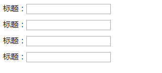

# <b>表单-垂直排列</b>



`HTML`

```html
<form >
    <div class="form-item">
        <label for="">标题：</label>
        <div class="input-area">
            <input type="text" name="" id="" value="" />
        </div>
    </div>
    <div class="form-item">
        <label for="">标题：</label>
        <div class="input-area">
            <input type="text" name="" id="" value="" />
        </div>
    </div>
    <div class="form-item">
        <label for="">标题：</label>
        <div class="input-area">
            <input type="text" name="" id="" value="" />
        </div>
    </div>
    <div class="form-item">
        <label for="">标题：</label>
        <div class="input-area">
            <input type="text" name="" id="" value="" />
        </div>
    </div>
</form>
```

`CSS`
```css
.form-item {
    margin-bottom: 10px;
    vertical-align: middle;
}

.form-item label {
    float: left;
}
```
