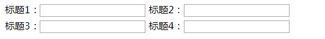

# <b>表单-水平排列</b>



`HTML`

```html
<form action="">
    <div class="form-inline">
        <div class="form-item">
            <label for="">标题1：</label>
            <div class="input-area">
                <input type="text" name="" id="" value="" />
            </div>
        </div>
        <div class="form-item">
            <label for="">标题2：</label>
            <div class="input-area">
                <input type="text" name="" id="" value="" />
            </div>
        </div>
    </div>
    <div class="form-inline">
        <div class="form-item">
            <label for="">标题3：</label>
            <div class="input-area">
                <input type="text" name="" id="" value="" />
            </div>
        </div>
        <div class="form-item">
            <label for="">标题4：</label>
            <div class="input-area">
                <input type="text" name="" id="" value="" />
            </div>
        </div>
    </div>
</form>
```

`CSS`
```css
.form-inline .form-item {
    display: inline-block;
}

.form-inline .form-item label {
    float: left;
}

.form-inline .form-item .input-area {
    float: left;
}
```
