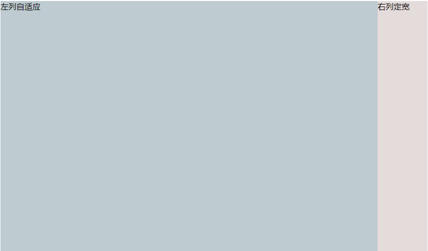

# <b>两列布局-右侧定宽</b>



##### <b>方案一：有父容器，利用`float+margin`实现。</b>

`HTML`

```html
<body>
<div id="parent">
    <div id="left">左列自适应</div>
    <div id="right">右列定宽</div>
</div>
</body>
    ```
`CSS`

```css
#parent{
    height: 500px;
    padding-left: 100px;  /*抵消#left的margin-left以达到#parent水平居中*/
}
#left {
    width: 100%;
    height: 500px;
    float: left;
    margin-left: -100px; /*正值等于#right的宽度*/
    background-color: #becbd0;
}
#right {
    height: 500px;
    width: 100px;
    float: right;
    background-color: #e4dbdb;
}
```
##### <b>方案二：有父容器，利用绝对定位实现。</b>

`HTML`
```html
<body>
    <div id="parent">
        <div id="left">左列自适应</div>
        <div id="right">右列定宽</div>
    </div>
</body>
```
`CSS`

```css
#parent{
    position: relative;  /*子绝父相*/
}
#left {
    position: absolute;
    top: 0;
    left: 0;
    right: 100px;  /*大于等于#rigth的宽度*/
    background-color: #becbd0;
    height: 500px;
}
#right {
    position: absolute;
    top: 0;
    right: 0;
    background-color: #e4dbdb;
    width: 100px;
    height: 500px;
}
```
##### <b>方案三：使用flex实现。</b>

`HTML`
```html
<body>
    <div id="parent">
        <div id="left">左列定宽</div>
        <div id="right">右列自适应</div>
    </div>
</body>
```
`CSS`

```css
#parent{
    height: 500px;
    display: flex;
}
#left {
    flex: 1;
    background-color: #becbd0;
}
#right {
    width: 100px;
    background-color: #e4dbdb;
}
```


