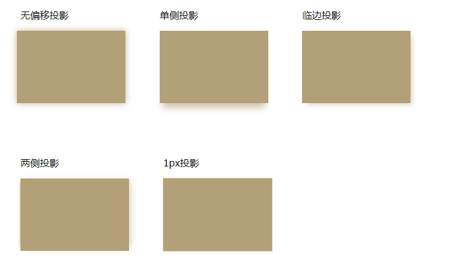

# <b>常见投影</b>



##### <b>方案：利用`box-shadow`实现。</b>

`HTML`

```html
<div class="projection one">
    <p>无偏移投影</p>
    <div></div>
</div>
<div class="projection two">
    <p>单侧投影</p>
    <div></div>
</div>
<div class="projection three">
    <p>临边投影</p>
    <div></div>
</div>
<div class="projection four">
    <p>两侧投影</p>
    <div></div>
</div>
<div class="projection five">
    <p>1px投影</p>
    <div></div>
</div>
```

`CSS`
```css
.projection {
    display: flex;
    flex-wrap: wrap;
    justify-content: space-around;
    align-items: center;
    padding-bottom: 20px;
    margin-bottom: 20px;
    display: inline-block;
    margin: 26px;
}

.projection>div {
    width: 180px;
    height: 120px;
    background: rgba(180, 160, 120);
}

.projection:not(:first-child:last-child)>div {
    border: 2px solid transparent;
    background-clip: content-box;
}

.projection:last-child {
    margin-bottom: 0;
    border-bottom: 0;
}

.one>div {
    margin-left: -6px;
    box-shadow: 0 0 16px rgba(180, 160, 120, .8);
}

.two>div {
    border-bottom: 0;
    box-shadow: 0px 13px 16px -5px rgba(180, 160, 120, .6);
}

.three>div {
    border-right: 0;
    border-bottom: 0;
    box-shadow: 5px 5px 15px -4px rgba(180, 160, 120, .6);
}

.four>div {
    border-right: 0;
    border-left: 0;
    box-shadow: 6px 0 20px -5px rgba(180, 160, 120, .6), 
               -6px 0 5px -5px rgba(180, 160, 120, .6);
}

.five>div {
    box-shadow: 0 0 0 1px rgba(180, 160, 120, .6);
}
```

<b>浏览器支持</b>
<iframe src="https://caniuse.bitsofco.de/embed/index.html?feat=css-animation&amp;periods=future_2,future_1,current,past_1,past_2,past_3&amp;accessible-colours=false" frameborder="0" width="100%" height="465px"></iframe>