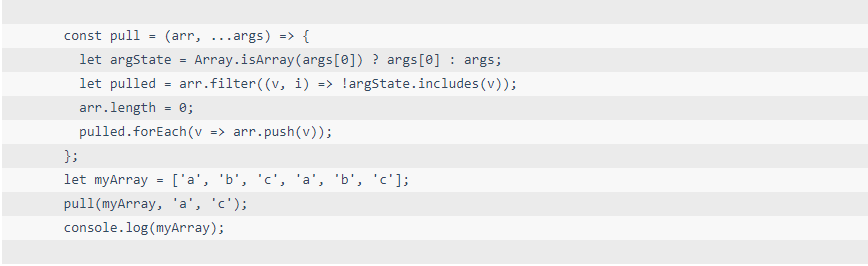

# <b>斑马线效果</b>



##### <b>方案：利用`linear-gradient`实现。</b>


`HTML`

```html
<div class="main">
    <pre>
        <code class="language-js">
            const pull = (arr, ...args) => {
                let argState = Array.isArray(args[0]) ? args[0] : args;
                let pulled = arr.filter((v, i) => !argState.includes(v));
                arr.length = 0;
                pulled.forEach(v => arr.push(v));
            };
            let myArray = ['a', 'b', 'c', 'a', 'b', 'c'];
            pull(myArray, 'a', 'c');
            console.log(myArray);
        </code>
    </pre>
</div>
```

`CSS`
```css
.main {
    width: 100%;
}

pre {
    width: 100%;
    display: inline-flex;
    background: #f8f8f8;
    background-image: linear-gradient(rgba(18, 18, 18, .05) 50%, transparent 0);
    background-size: auto 48px;
    background-origin: content-box;
    font: 14px/24px Consolas, Monaco, monospace;
}

.main pre>code {
    display: inline-block;
    padding: 0;
    color: #34495e;
    background-color: transparent;
    font: inherit;
}
```
##### <b>浏览器支持率 95.36%</b>

<iframe src="https://caniuse.bitsofco.de/embed/index.html?feat=css-gradients&amp;periods=future_2,future_1,current,past_1,past_2,past_3&amp;accessible-colours=false" frameborder="0" width="100%" height="465px"></iframe>