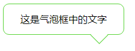

# <b>气泡对话框</b>



##### <b>方案：利用`transform`实现。</b>

`HTML`

```html
<div class="frame">
    这是气泡框中的文字
    <span class="triangle"></span>
</div>
```

`CSS`
```css
.frame {
    width: 200px;
    height: 50px;
    border: 1px solid #59d438;
    border-radius: 10px;
    position: relative;
    line-height: 50px;
    text-align: center;
}

.triangle {
    width: 20px;
    height: 20px;
    display: inline-block;
    position: absolute;
    bottom: -12px;
    right: 30px;
    background-color: #fff;
    border-top: 1px solid #59d438;
    border-left: 1px solid #59d438;
    transform: rotate(225deg);
    -ms-transform: rotate(225deg);
    /* IE 9 */
    -moz-transform: rotate(225deg);
    /* Firefox */
    -webkit-transform: rotate(225deg);
    /* Safari 和 Chrome */
    -o-transform: rotate(225deg);
    /* Opera */
}

```

<b>浏览器支持</b>
<iframe src="https://caniuse.bitsofco.de/embed/index.html?feat=transforms2d&amp;periods=future_2,future_1,current,past_1,past_2,past_3&amp;accessible-colours=false" frameborder="0" width="100%" height="490px"></iframe>