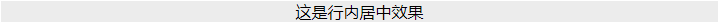

# 水平居中

##### <b>情况一： 行内居中</b>



`HTML`

```html
<div id="parent">这是行内居中</div>
```

`CSS`

```css
.parent{
    text-align: center;
}
.child{
    display: inline-block;
}
```

##### <b>情况二： 行内居中</b>

##### <b>情况二： 行内居中</b>

##### <b>情况二： 行内居中</b>