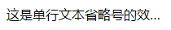

# 省略号

<b>1. 单行文本省略号显示</b>

`HTML`
```html
<p class="ellipsis">这是单行文本省略号的效果，这是单行文本省略号的效果，这是单行文</p>
```
`CSS`

```css
.ellipsis {
    overflow: hidden;
    white-space: nowrap;
    text-overflow: ellipsis;
    width: 200px;
}
```
<b>效果</b>



<b>2. 多行文本省略号显示</b>

`HTML`
```html
<p class="ellipsis">这是多行文本省略号的效果，这是多行文本省略号的效果，这是多行文</p>
```

`CSS`
```css
.ellipsis {
    position: relative;
    line-height: 1.4em;
    height: 4.2em; /* 3倍行高显示三行内容*/
    overflow: hidden;
    width: 200px;
}

p::after {
    content: "...";
    font-weight: bold;
    position: absolute;
    bottom: 0;
}
```
<b>效果</b>


<b>浏览器支持</b>
<iframe src="https://caniuse.bitsofco.de/embed/index.html?feat=text-overflow&amp;periods=future_2,future_1,current,past_1,past_2,past_3&amp;accessible-colours=false" frameborder="0" width="100%" height="500px"></iframe>