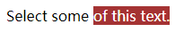

# <b>自定义文本选择</b>



##### <b>方案：利用伪元素 `:selection` 实现。</b>


`HTML`

```html
<p class="custom-text-selection">Select some of this text.</p>
```

`CSS`
```css
::selection {
  background: aquamarine;
  color: black;
}
.custom-text-selection::selection {
  background: deeppink;
  color: white;
}
```

<b>浏览器支持率 98.4% </b>
<iframe src="https://caniuse.bitsofco.de/embed/index.html?feat=css-sel3&amp;periods=future_2,future_1,current,past_1,past_2,past_3&amp;accessible-colours=false" frameborder="0" width="100%" height="550px"></iframe>