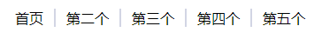

# <b>:非选择器</b>

<b>效果：</b>



`HTML`

```html
<ul class="css-not-selector-shortcut">
    <li>One</li>
    <li>Two</li>
    <li>Three</li>
    <li>Four</li>
    <li>Five</li>
</ul>
```

`CSS`
```css
.css-not-selector-shortcut {
    display: flex;
}

li {
    list-style-type: none;
    margin: 0;
    padding: 0 0.75rem;
}

li:not(:last-child) {
    border-right: 2px solid #d2d5e4;
}
```
<b>浏览器支持</b>
<iframe src="https://caniuse.bitsofco.de/embed/index.html?feat=css-sel3&amp;periods=future_2,future_1,current,past_1,past_2,past_3&amp;accessible-colours=false" frameborder="0" width="100%" height="530px"></iframe>
<iframe src="https://caniuse.bitsofco.de/embed/index.html?feat=flexbox&amp;periods=future_1,current,past_1,past_2,past_3&amp;accessible-colours=false" frameborder="0" width="100%" height="472px"></iframe>